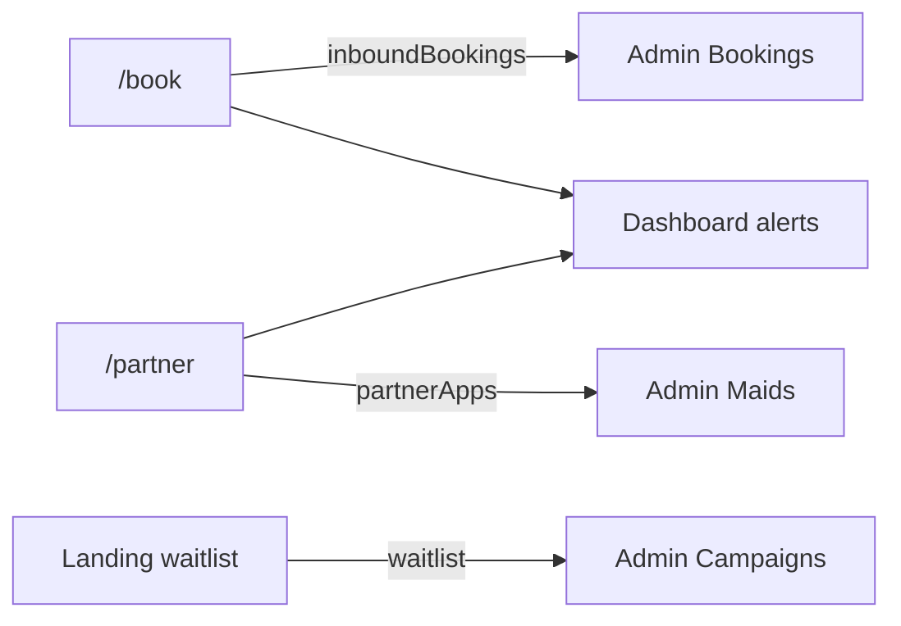

# QuickMaid

<p align="center">
  <strong>Verified maid & home cleaning in Raipur</strong><br>
  Public marketing site · Web booking · Partner portal · Full admin console
</p>

<p align="center">
  <a href="https://github.com/Deepesh2104/QuickMaid">GitHub</a> ·
  <a href="./docs/README.md">Documentation</a> ·
  <a href="./docs/DEMO_WALKTHROUGH.md">Demo script</a>
</p>

---

QuickMaid is an Angular 18 **UI prototype** for a home-cleaning marketplace. It includes a customer-facing website, partner onboarding, and a 25+ screen admin console — all runnable locally with **no backend required**.

Data flows between public pages and admin via browser `localStorage`, so live demos feel end-to-end connected.

> **Status:** Phase 1–2 (front-end demo). Production API, payments, and SMS are planned for Phase 3. See [Phase 3 Backend](./docs/PHASE3_BACKEND.md).

---

## Documentation

| Guide | Description |
|-------|-------------|
| [**Docs index**](./docs/README.md) | Full documentation map |
| [**Architecture**](./docs/ARCHITECTURE.md) | Services, state, guards, data flow |
| [**Development**](./docs/DEVELOPMENT.md) | Conventions, adding features, CSS |
| [**Admin guide**](./docs/ADMIN_GUIDE.md) | Every admin screen explained |
| [**Demo walkthrough**](./docs/DEMO_WALKTHROUGH.md) | 15-minute live demo script |
| [**Deployment**](./docs/DEPLOYMENT.md) | Build, hosting, SPA config |
| [**Phase 3 backend**](./docs/PHASE3_BACKEND.md) | Planned API integration |

---

## Quick start

```bash
git clone https://github.com/Deepesh2104/QuickMaid.git
cd QuickMaid
npm install
npm start
```

Open **http://localhost:4200**

| Command | Description |
|---------|-------------|
| `npm start` | Dev server (opens browser) |
| `npm run build` | Production build → `dist/quickmaid/` |
| `npm run watch` | Dev build with watch |
| `npm run audit:css` | CSS bundle size report |

**Requires:** Node.js 18+ or 20+ LTS

---

## Demo credentials

### Admin login (`/auth`)

| Field | Value |
|-------|-------|
| Email or phone | Any valid format (e.g. `ops@quickmaid.in` or `9876543210`) |
| Password | Anything (not verified server-side) |
| Role | Admin / Manager / Analyst / Support |

→ Redirects to `/admin/dashboard`

### Web booking OTP (`/book`)

Demo OTP: **`123456`**

### Reset demo data

`/admin/settings` → Reset demo data → type **`RESET`**

---

## Features at a glance

### Public site

| Page | Path | Highlights |
|------|------|------------|
| Landing | `/` | Hero, services, pricing, testimonials, city waitlist |
| Book | `/book` | Multi-step flow: details → OTP → payment → confirm |
| Partner | `/partner` | Maid dashboard + onboarding wizard |
| Auth | `/auth` | Staff login / signup |
| About / Contact | `/about`, `/contact` | Company info |
| Legal | `/terms`, `/privacy` | Terms & privacy |
| Status | `/status` | Service status |

### Admin console (`/admin`)

| Section | Screens |
|---------|---------|
| **Main** | Dashboard, Executive, Bookings, Dispatch, Customers, Maids, Add maid |
| **Finance** | Revenue, Payouts, Plans, Reports, Campaigns, Corporate |
| **Operations** | Zones, Reviews, Training & QC |
| **People** | Team, Support, Knowledge base, Alerts |
| **Platform** | Audit, Compliance, Integrations, Settings |

**UI patterns:** modals, CSV exports, Chart.js charts, profile drawers, live nav badges, theme picker (6 presets).

---

## Cross-app demo flows



| Flow | Steps |
|------|-------|
| **Web booking** | `/book` → complete payment → `/admin/bookings` (Web badge) |
| **Partner apply** | `/partner` onboarding → `/admin/maids` review queue → Approve |
| **City waitlist** | Landing form → `/admin/campaigns` waitlist table |

Full script: [Demo Walkthrough](./docs/DEMO_WALKTHROUGH.md)

---

## Tech stack

| Layer | Technology |
|-------|------------|
| Framework | Angular 18 (standalone, signals, OnPush) |
| Language | TypeScript 5.5 strict |
| Routing | Lazy-loaded routes, path URLs |
| Charts | Chart.js 4.x |
| Styling | Plain CSS + design tokens |
| State | Signals + localStorage (demo) |

**Path aliases:** `@core`, `@shared`, `@layouts`, `@features`

---

## Project structure

```
QuickMaid/
├── README.md
├── docs/                    # Full documentation
├── src/
│   ├── app/
│   │   ├── core/            # Services, guards, tokens
│   │   ├── shared/          # Toast, theme-picker, mobile-block
│   │   ├── layouts/         # Admin shell
│   │   └── features/        # landing, auth, book, partner, admin, …
│   ├── styles.css           # Global tokens + adm-* system
│   ├── assets/
│   └── host-config/_redirects
├── angular.json
└── package.json
```

---

## Storage keys (demo)

| Key | Purpose |
|-----|---------|
| `qm_app_state` | Bookings, partners, waitlist, approved maids, audit |
| `qm_settings` | Platform toggles |
| `qm_session_v1` | Active auth session |
| `qm_session_remember_v1` | Remember-me session |
| `quickmaid-theme-v2` | Theme preset |

Details: [Architecture → Storage](./docs/ARCHITECTURE.md#storage-reference)

---

## Deployment

```bash
npm run build
# Deploy dist/quickmaid/ to static host
# Configure SPA fallback: /* → /index.html (200)
```

See [Deployment Guide](./docs/DEPLOYMENT.md) for Netlify, Vercel, Nginx, and Cloudflare.

Update `SITE_ORIGIN` in `src/app/core/site.constants.ts` for your domain.

---

## Mock vs production

| Area | Demo (now) | Production (Phase 3) |
|------|------------|----------------------|
| Auth | localStorage session | JWT + RBAC API |
| Bookings / maids | `AppStateService` | REST API + database |
| OTP / SMS | Toast + `123456` | MSG91 / Twilio |
| Payments | Simulated | Razorpay |
| Support | In-memory tickets | Ticketing API |
| Tests | None | Unit + E2E |

---

## Troubleshooting

| Issue | Solution |
|-------|----------|
| Build fails on fonts | Retry with network, or use `npm start` |
| Booking not in admin | Same browser profile; check localStorage |
| Mobile block on admin | Use viewport ≥ 1024px wide |
| Stale session | Logout or clear `qm_session_*` keys |

More: [Development Guide → Troubleshooting](./docs/DEVELOPMENT.md#build-troubleshooting)

---

## Contributing

1. Branch from `main`
2. Follow existing patterns (standalone, signals, OnPush, `adm-*` CSS)
3. Run `npm run build` before PR
4. Never commit `.env` or API keys

---

## License

Private project. All rights reserved.
