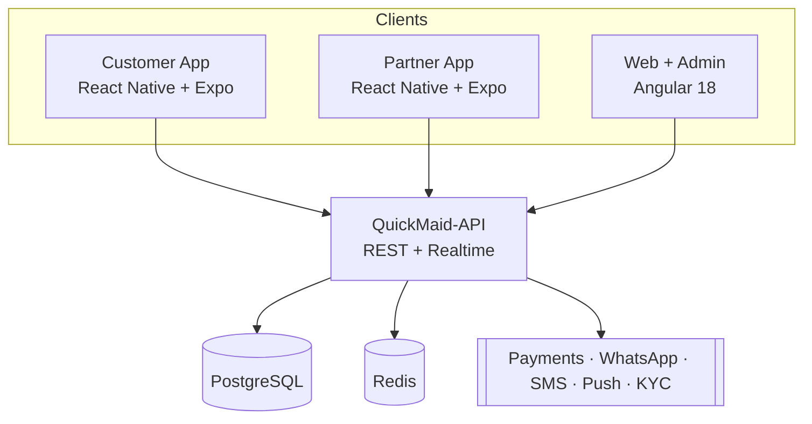

# QuickMaid — Platform Documentation

<p align="center">
  <strong>Verified maid & home-cleaning marketplace · Raipur, Chhattisgarh</strong><br>
  Customer mobile app · Partner mobile app · Web marketing & booking · Admin console · REST API
</p>

<p align="center">
  <a href="https://github.com/Deepesh2104/QuickMaid">Web repo</a> ·
  <a href="https://github.com/Deepesh2104/QuickMaid-App">Mobile repo</a> ·
  <a href="./docs/README.md">Web docs</a>
</p>

---

This is the **master platform README** for QuickMaid. It covers all three products — the **web + admin console**, the **customer & partner mobile apps**, and the **backend REST API** — plus the complete API surface that connects them.

> **Note:** This file lives in the **QuickMaid (web)** repo as the canonical platform overview. Each repo also keeps its own focused docs.

---

## Table of contents

1. [What is QuickMaid](#what-is-quickmaid)
2. [Architecture](#architecture)
3. [Repositories](#repositories)
4. [The three clients](#the-three-clients)
5. [Tech stack](#tech-stack)
6. [Complete API reference](#complete-api-reference)
7. [Realtime channels](#realtime-channels)
8. [Core data entities](#core-data-entities)
9. [Quick start](#quick-start)
10. [Demo credentials](#demo-credentials)
11. [Build phases / roadmap](#build-phases--roadmap)
12. [Contributing](#contributing)
13. [License](#license)

---

## What is QuickMaid

QuickMaid is an on-demand **home-help marketplace** — verified maids and home-cleaning partners booked in minutes via web or WhatsApp. Key principles:

- **Aadhaar-verified partners** with police/background checks
- **OTP on every visit** (safe check-in & check-out)
- **Transparent pricing**, zero agent commission
- **Monthly / annual plans** with the same dedicated partner
- **₹5,000 damage cover** per booking

Currently live in **Raipur, Bhilai & Durg**, with a waitlist for Nagpur, Bilaspur and Raigarh.

---

## Architecture

All clients talk to **one backend (`QuickMaid-API`)**, which owns the single **PostgreSQL** database. Clients never touch the DB directly.



---

## Repositories

| Repository | Purpose | Stack | Status |
|------------|---------|-------|--------|
| [**QuickMaid**](https://github.com/Deepesh2104/QuickMaid) | Marketing site, web booking, partner web portal, **25-screen admin console** | Angular 18 | ✅ Built (demo, localStorage) |
| [**QuickMaid-App**](https://github.com/Deepesh2104/QuickMaid-App) | **Customer** + **Partner** native mobile apps | React Native + Expo (TS monorepo) | ✅ Built (demo, AsyncStorage) |
| **QuickMaid-API** | Backend REST API + business logic + realtime | (Phase 3 — to scaffold) | ⏳ Planned |

---

## The three clients

### 1. Customer mobile app (`QuickMaid-App/apps/customer`)

60+ screens. Flows: onboarding → city → OTP login → signup → home → catalogue → service detail → checkout (address, schedule, payment, success) → bookings (track, reschedule, cancel, invoice, receipt, rate, dispute) → Plus subscription (subscribe, manage, billing) → payments → wallet → coupons → referrals → notifications → support (tickets, chat) → account (addresses, app-lock, delete).

### 2. Partner mobile app (`QuickMaid-App/apps/partner`)

45+ screens. Flows: onboarding → apply → OTP → KYC → home → requests (accept/reject) → jobs (start/complete with OTP, history) → schedule & slots → earnings → payouts → referrals → profile & rating → notifications → support → settings → account.

### 3. Web + admin (`QuickMaid`)

| Area | Path | Description |
|------|------|-------------|
| Landing | `/` | Hero, services, plans, FAQ, waitlist |
| Book | `/book` | 4-step web booking |
| Partner | `/partner` | Maid web onboarding/preview |
| Auth | `/auth` | Staff login → admin |
| Public | `/about`, `/contact`, `/terms`, `/privacy`, `/status` | Info & legal |
| **Admin** | `/admin/*` | 25+ ops screens — bookings, dispatch, maids, customers, payouts, plans, zones, reviews, quality, compliance, audit, reports, revenue, executive, campaigns, corporate, integrations, knowledge-base, support, team, settings |

---

## Tech stack

| Layer | Technology |
|-------|------------|
| Web + admin | Angular 18 (standalone, signals, OnPush), TypeScript 5.5, Chart.js |
| Mobile | React Native + Expo, expo-router, TypeScript, AsyncStorage |
| API (planned) | REST + realtime (SignalR/WebSocket) |
| Database (planned) | PostgreSQL + Redis (cache/queues) |
| External | Payments (UPI/gateway), WhatsApp Business, SMS OTP, Push (FCM/APNs), KYC/Aadhaar |

---

## Complete API reference

The full backend surface is **~185 REST endpoints across 23 modules**, plus 5 realtime channels. Grouped below.

### A. Shared / Auth

| Module | Key endpoints | Count |
|--------|---------------|-------|
| **Auth & Identity** | OTP request, OTP verify, refresh, logout, `GET /me`, customer register, partner apply, admin login/refresh/logout | 10 |

### B. Customer app

| Module | Key endpoints | Count |
|--------|---------------|-------|
| Profile & Account | get/update me, avatar upload, delete account, app-lock get/set | 8 |
| Addresses | list, add, update, delete, set-default | 5 |
| Catalogue / Services | services list+filter, detail, categories, cities, zones, pros list+detail | 7 |
| Booking & Checkout | quote, create, list, detail, cancel, reschedule, track, invoice, receipt, rate, dispute, slots | 13 |
| Payments & Wallet | initiate, verify, detail, history, refund, wallet balance, wallet txns | 8 |
| Plans / Plus | plans, subscribe, my-sub, pause, resume, cancel, billing, sub-payment | 8 |
| Coupons & Referrals | coupon wallet, redeem, referral ledger, invite, my code | 6 |

### C. Partner app

| Module | Key endpoints | Count |
|--------|---------------|-------|
| Profile & KYC | get/update me, photo, KYC submit, KYC status, bank/UPI, delete | 7 |
| Requests & Jobs | requests, accept, reject, jobs, detail, history, start (OTP), complete (OTP), location ping | 9 |
| Availability / Slots | get slots, set slots, schedule, online toggle | 5 |
| Earnings & Payouts | earnings summary, payouts, payout detail, withdraw | 5 |
| Rating & Referral | my rating, referrals, invite | 4 |

### D. Shared app (customer + partner)

| Module | Key endpoints | Count |
|--------|---------------|-------|
| Notifications | list, detail, mark-read, read-all, register push token | 5 |
| Support | tickets list, create, detail, send message, thread | 6 |

### E. Web public

| Module | Key endpoints | Count |
|--------|---------------|-------|
| Public / Marketing | web booking (guest), partner application, waitlist, contact, cities, FAQs | 7 |

### F. Admin panel

| Module | Key endpoints | Count |
|--------|---------------|-------|
| Bookings | list+filter, detail, update, assign | 4 |
| Dispatch | board, auto-assign, manual assign, rebalance | 4 |
| Maids / Partners | list, detail, add, suspend/activate, applications, approve, reject, KYC verify | 9 |
| Customers | list, detail, update, export | 4 |
| Payouts & Revenue | payouts, batch run, detail, revenue, reports, executive KPIs | 7 |
| Plans / Zones / Campaigns / Corporate | 4 modules × CRUD | 16 |
| Quality / Reviews / Compliance / Audit / KB | reviews+moderate, quality, compliance, audit, KB CRUD | 11 |
| Admin Support | tickets, detail, reply, assign, status | 5 |
| Team / Settings / Notifications / Integrations | team CRUD, settings, notifications, integrations | 10 |

### Totals

| Group | Endpoints |
|-------|-----------|
| Auth (shared) | 10 |
| Customer app | 55 |
| Partner app | 30 |
| Shared (notif + support) | 11 |
| Web public | 7 |
| Admin panel | 70 |
| **Total REST** | **~185** |

---

## Realtime channels

| Channel | Use |
|---------|-----|
| `booking-status` | Live booking updates for customer |
| `dispatch` | Admin board live job movement |
| `partner-location` | Live tracking map |
| `chat` | Support + partner ↔ customer messaging |
| `notifications` | Push / in-app real-time |

---

## Core data entities

| Entity | Notes |
|--------|-------|
| **Customer** | `CU-{id}`, profile, city/zone, addresses, avatar |
| **Partner / Maid** | `MD-{id}`, KYC status, skills, languages, slots, bank/UPI, rating |
| **Booking** | service, slot, address, amount, status, OTP, source (web/app) |
| **Service / Category** | catalogue, price, duration, perks, badge |
| **Subscription (Plus)** | plan, billing cycle, pause/resume, visits |
| **Payment / Wallet** | intent, status, refunds, ledger |
| **Coupon / Referral** | code, redemption, ledger |
| **Payout** | partner earnings, batches, status |
| **Support ticket** | thread, status, assignee |
| **Notification** | inbox, read state, push token |
| **Audit log** | actor, action, target, timestamp |
| **City / Zone** | live/soon, dispatch matching |

---

## Quick start

### Web + admin (`QuickMaid`)

```bash
git clone https://github.com/Deepesh2104/QuickMaid.git
cd QuickMaid
npm install
npm start          # http://localhost:4200
```

| Command | Description |
|---------|-------------|
| `npm start` | Dev server |
| `npm run build` | Production build → `dist/quickmaid/` |
| `npm run watch` | Dev build with watch |

**Requires:** Node.js 18+ / 20+ LTS

### Mobile apps (`QuickMaid-App`)

```bash
git clone https://github.com/Deepesh2104/QuickMaid-App.git
cd QuickMaid-App
npm install
# Customer
cd apps/customer && npx expo start
# Partner
cd apps/partner && npx expo start
```

---

## Demo credentials

| Flow | How |
|------|-----|
| **Admin** | `/auth` → valid email/phone + any password → `/admin/dashboard` |
| **Web booking OTP** | `/book` → OTP **`123456`** |
| **Reset web demo** | `/admin/settings` → type **`RESET`** |
| **Mobile auth OTP** | see `apps/*/shared/demo-otp` |

---

## Build phases / roadmap

| Phase | Repo | Deliverable | Status |
|-------|------|-------------|--------|
| 1 | QuickMaid | Web + admin demo | ✅ |
| 2 | QuickMaid-App | Customer + Partner mobile demo | ✅ |
| 3 | QuickMaid-API | Core API MVP (~70: auth, profile, catalogue, booking, payments, partner jobs, dispatch) + realtime | ⏳ |
| 4 | QuickMaid-API | Engagement APIs (~40: plans, coupons, referrals, notifications, support, wallet) | ⏳ |
| 5 | QuickMaid-API | Admin & ops APIs (~70) | ⏳ |
| 6 | All | Connect web + mobile to live API | ⏳ |

---

## Documentation map

| Repo | Docs |
|------|------|
| Web | [`docs/README.md`](./docs/README.md) · [Architecture](./docs/ARCHITECTURE.md) · [Admin Guide](./docs/ADMIN_GUIDE.md) · [Public Guide](./docs/PUBLIC_GUIDE.md) · [Platform](./docs/PLATFORM.md) · [Phase 3 Backend](./docs/PHASE3_BACKEND.md) |
| Mobile | `QuickMaid-App/docs/` — SRS, TDD, API-CONTRACT, SYSTEM-DESIGN, per-screen FSD |

---

## Contributing

1. Branch from `main`
2. Match existing patterns (Angular: standalone + signals + OnPush; Mobile: expo-router + TS)
3. Run the build before opening a PR
4. **Never** commit `.env`, API keys, or credentials

---

## License

Private project. All rights reserved.
