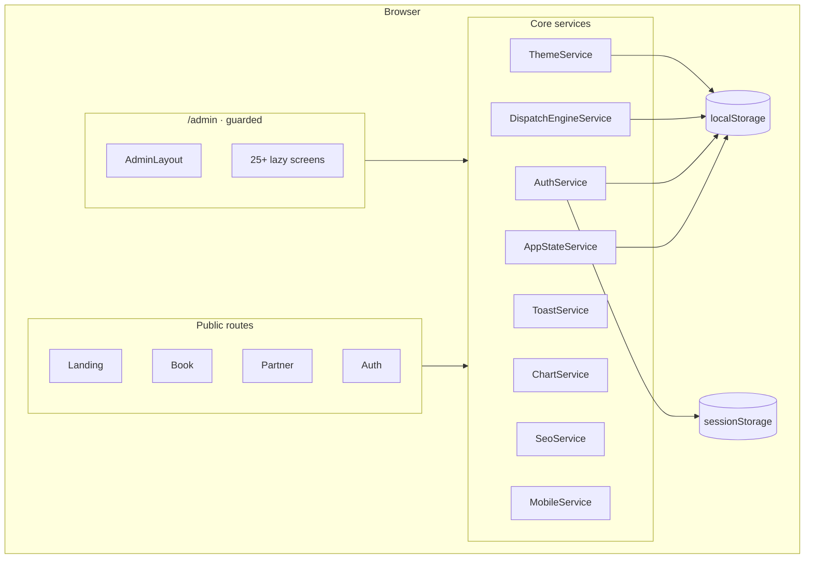

# Architecture

How QuickMaid is structured — routing, services, state, and UI patterns.

## High-level diagram



## Application bootstrap

| File | Role |
|------|------|
| `src/main.ts` | Bootstraps `AppComponent` with `appConfig` |
| `src/app/app.config.ts` | `provideRouter`, zone change detection |
| `src/app/app.routes.ts` | Top-level route table |
| `src/app/app.component.ts` | Root shell: `<router-outlet>`, toast, mobile block, theme |

**Routing strategy:** `PathLocationStrategy` (clean URLs, no hash). Hosting must serve `index.html` for all paths.

## Feature modules (logical)

Features live under `src/app/features/` as standalone components — no NgModules.

| Feature | Path prefix | Lazy loaded |
|---------|-------------|-------------|
| Landing | `/` | Yes (`landing.routes`) |
| Auth | `/auth` | Yes |
| Admin | `/admin/*` | Yes (`admin.routes`) |
| Book | `/book` | Component lazy |
| Partner | `/partner` | Component lazy |
| Public pages | `/about`, `/contact` | Component lazy |
| SEO pages | `/terms`, `/privacy` | Component lazy |
| Status | `/status` | Component lazy |

## Admin shell

`AdminLayoutComponent` wraps all `/admin` child routes:

- **Sidebar** — sections from `admin-nav.config.ts`
- **Topbar** — breadcrumb, theme picker, notifications link, user chip, logout
- **Live badges** — bookings, maids, support, campaigns counts from `AppStateService`

**Support exception:** `/admin/support` uses `support-host` CSS class to hide sidebar/topbar for a full-width ticket desk.

## Guards

| Guard | File | Behavior |
|-------|------|----------|
| `authGuard` | `core/guards/auth.guard.ts` | Redirects unauthenticated users to `/auth?returnUrl=…` |
| `desktopOnlyGuard` | `core/guards/desktop-only.guard.ts` | Always allows route; mobile UX handled by `<app-mobile-block>` |

`AuthService.safeAdminReturnUrl()` prevents open redirects — only `/admin` paths are accepted.

## Core services

### `AuthService`

Demo session management. No API calls.

```typescript
interface QmSession {
  loginId: string;
  displayName: string;
  role: string;  // Admin | Manager | Analyst | Support L1
  at: number;
}
```

| Method | Description |
|--------|-------------|
| `login(payload, { remember })` | Writes session to storage |
| `logout()` | Clears session |
| `isAuthenticated` | Computed signal |
| `safeAdminReturnUrl(url)` | Validates post-login redirect |

### `AppStateService` — cross-flow demo state

Central persistence for public → admin wiring.

| Signal | Type | Source |
|--------|------|--------|
| `inboundBookings` | `InboundBooking[]` | `/book` completion |
| `partnerApps` | `PartnerApplication[]` | `/partner` onboarding submit |
| `waitlist` | `WaitlistEntry[]` | Landing waitlist form |
| `approvedMaids` | `PersistedMaidRow[]` | Admin maids approve action |
| `extraAudit` | `AuditEntry[]` | `logAudit()` calls |

Computed helpers: `inboundCount`, `partnerPendingCount`, `waitlistCount`, `auditLog` (merged with seed data), nav badge strings.

**Persistence key:** `qm_app_state` in `localStorage`.

### `DispatchEngineService`

Shared dispatch board state used by **Bookings** and **Dispatch** screens:

- Unassigned job queue
- Maid roster with assigned jobs
- Slot risk indicators
- Activity log
- Methods: drag-assign, auto-assign, rebalance, backup assign

Exports `QM_SETTINGS_KEY = 'qm_settings'` (also used by Settings).

### `ThemeService`

Applies `body.theme-*` classes. Presets: orange, teal, indigo, emerald, violet, slate-coral.

**Key:** `quickmaid-theme-v2`

### `ToastService`

Global toast queue: `{ msg, icon }` with auto-dismiss. Rendered by `<app-toast>`.

### `ChartService`

Chart.js lifecycle wrapper — destroys existing chart on canvas before recreate.

### `SeoService`

Sets `document.title`, meta description, canonical, Open Graph, Twitter cards, JSON-LD. Used on public pages only.

### `MobileService`

Detects viewport &lt; 1024px. Drives `MobileBlockComponent` on `/admin` and `/auth`.

## Admin-local services

| Service | Location | Purpose |
|---------|----------|---------|
| `TicketService` | `admin/support/data/` | Ticket list state |
| `SupportFacadeService` | `admin/support/data/` | Support desk orchestration |

## Shared UI components

| Component | Selector | Location |
|-----------|----------|----------|
| Toast | `app-toast` | `shared/ui/toast/` |
| Theme picker | `app-theme-picker` | `shared/ui/theme-picker/` |
| Mobile block | `app-mobile-block` | `shared/ui/mobile-block/` |

## Storage reference

| Key | Storage | Owner | Data |
|-----|---------|-------|------|
| `qm_app_state` | localStorage | AppStateService | Bookings, partners, waitlist, maids, audit |
| `qm_settings` | localStorage | SettingsComponent | Platform toggles |
| `quickmaid-theme-v2` | localStorage | ThemeService | Theme preset id |
| `qm_session_v1` | sessionStorage | AuthService | Active session |
| `qm_session_remember_v1` | localStorage | AuthService | Remember-me session |

## Data flow: web booking

```
/book (payAndConfirm)
  → AppStateService.addInboundBooking()
  → localStorage qm_app_state
  → BookingsComponent reads inboundBookings
  → Dashboard ops alert banner
  → Nav badge count updates
```

## Data flow: partner approval

```
/partner (submit onboarding)
  → AppStateService.addPartnerApplication()
  → MaidsComponent partner queue
  → Admin approves
  → AppStateService.addApprovedMaid() + removePartnerApp()
  → Roster persists across refresh
```

## Change detection

All feature components use `ChangeDetectionStrategy.OnPush` with Angular **signals** for local state. Services expose `signal()` and `computed()` for shared reactive state.

## Path aliases

```json
"@core/*"     → "src/app/core/*"
"@shared/*"   → "src/app/shared/*"
"@layouts/*"  → "src/app/layouts/*"
"@features/*" → "src/app/features/*"
```

## CSS architecture

| Layer | Files | Prefix |
|-------|-------|--------|
| Global tokens | `src/styles.css` | `:root`, `body.theme-*` |
| Admin list pages | `styles.css` (global block) | `adm-*` |
| Dashboard | `dashboard.component.css` | `dash-*` |
| Support desk | `support.component.css` | `sp-*`, `support-host` |
| Profile modals | `admin/shared/admin-profile.css` | `prf-*` |
| Public shell | `public-shell.css`, `qm-public.css` | landing, book, partner |

See [Development Guide](./DEVELOPMENT.md#css-conventions) for class reference.

## Security notes (prototype)

- No real authentication or authorization
- Integration secrets UI stores values in component state only (not persisted)
- `safeAdminReturnUrl` blocks external redirects
- Admin blocked on mobile viewports (UX choice, not security)
- Do not commit real API keys or `.env` files

## Related docs

- [Development Guide](./DEVELOPMENT.md) — how to add screens and services
- [Admin Guide](./ADMIN_GUIDE.md) — screen-by-screen reference
- [Phase 3 Backend](./PHASE3_BACKEND.md) — planned API replacement for demo state
