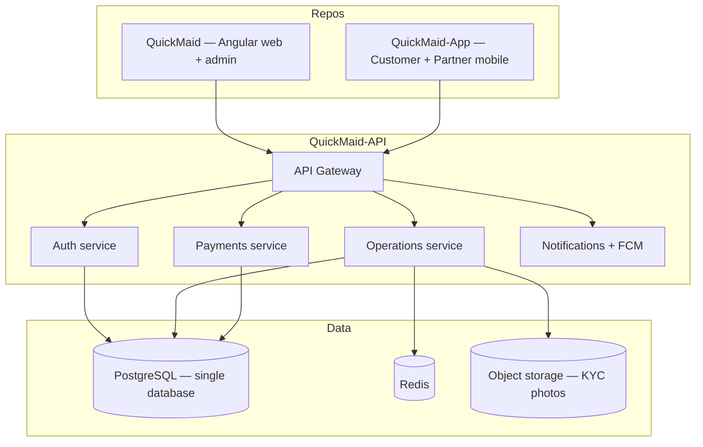

# Phase 3 — Backend Integration Plan

This document outlines how to replace demo/local state with a production backend. The current UI is designed as a **contract** for future APIs.

## Current state (prototype)

| Concern | Implementation |
|---------|----------------|
| Auth | `AuthService` → localStorage/sessionStorage |
| Bookings, partners, waitlist | `AppStateService` → `qm_app_state` |
| Dispatch | `DispatchEngineService` → in-memory signals |
| Support tickets | `TicketService` → in-memory |
| Charts/KPIs | Seeded + derived demo data |
| Integrations | UI vault only |

## Target architecture (multi-repo, one database)



| Client | Repository | Connects via |
|--------|------------|--------------|
| Admin web + marketing | `QuickMaid` | Angular `HttpClient` |
| Customer app (42 screens) | `QuickMaid-App` | REST + JWT (React Native) |
| Partner app (32 screens) | `QuickMaid-App` | REST + JWT (React Native) |

Mobile apps **never** connect to the database directly. Mobile implementation docs → **QuickMaid-App** repository. Platform overview → [PLATFORM.md](./PLATFORM.md).

## Recommended API domains

### Authentication (`/api/v1/auth`)

| Endpoint | Method | Replaces |
|----------|--------|----------|
| `/login` | POST | `AuthService.login()` |
| `/logout` | POST | `AuthService.logout()` |
| `/refresh` | POST | Remember-me token refresh |
| `/me` | GET | Session restore |
| `/invite` | POST | Team invite flow |
| `/roles` | GET/PATCH | RBAC |

**Auth model:** JWT access token (short) + refresh token (httpOnly cookie) or server session.

### Bookings (`/api/v1/bookings`)

| Endpoint | Method | Replaces |
|----------|--------|----------|
| `/` | GET | Bookings list + filters |
| `/` | POST | `/book` flow completion |
| `/:id` | GET/PATCH | Detail, status updates |
| `/:id/reassign` | POST | Dispatch reassign |
| `/:id/cancel` | POST | Cancel |
| `/:id/refund` | POST | Refund |

### Partners / Maids (`/api/v1/maids`)

| Endpoint | Method | Replaces |
|----------|--------|----------|
| `/applications` | GET/POST | Partner queue |
| `/applications/:id/approve` | POST | Approve partner |
| `/applications/:id/reject` | POST | Reject |
| `/` | GET/POST | Roster CRUD |
| `/:id/kyc` | PATCH | KYC status |
| `/:id/suspend` | POST | Suspend |

### Customers (`/api/v1/customers`)

CRM list, segments, profile, outreach history.

### Dispatch (`/api/v1/dispatch`)

Real-time board: unassigned jobs, maid locations, auto-assign algorithm.

Consider WebSocket or SSE for live updates.

### Finance

| Domain | Endpoints |
|--------|-----------|
| Revenue | GMV aggregates, ledger |
| Payouts | Batches, holds, UPI transfers |
| Plans | Subscriptions, pricing rules |

### Growth

| Domain | Endpoints |
|--------|-----------|
| Campaigns | Coupons, promos |
| Waitlist | City expansion signups |
| Corporate | B2B accounts, invoicing |

### Support (`/api/v1/tickets`)

Full ticket CRUD, messages, merge, CSAT, canned replies.

### Platform

| Domain | Endpoints |
|--------|-----------|
| Audit | Append-only log stream |
| Compliance | DSAR requests |
| Integrations | Secrets via vault (not in DB plaintext) |
| Settings | Platform toggles |
| Notifications | Alert routing rules |

## Angular integration steps

### 1. Create API layer

```
src/app/core/
├── interceptors/
│   ├── auth.interceptor.ts
│   └── error.interceptor.ts
├── services/
│   └── api/
│       ├── bookings-api.service.ts
│       ├── maids-api.service.ts
│       └── ...
└── models/
    └── api.types.ts
```

### 2. Replace `AppStateService` incrementally

| Phase | Action |
|-------|--------|
| 3a | Bookings API — keep `AppStateService` as cache |
| 3b | Partners + waitlist API |
| 3c | Remove `qm_app_state` persistence |
| 3d | Real-time dispatch WebSocket |

### 3. Auth interceptor

```typescript
// Attach Bearer token; on 401 → refresh or redirect /auth
```

### 4. Environment files

```typescript
// src/environments/environment.ts
export const environment = {
  production: false,
  apiUrl: 'http://localhost:3000/api/v1',
};
```

Add `environment.prod.ts` for production API URL. **Do not commit secrets.**

## Third-party integrations

| Service | UI screen | Production provider (India) |
|---------|-----------|----------------------------|
| SMS / OTP | Settings → SMS OTP | MSG91, Twilio |
| Payments | `/book` payment step | Razorpay |
| WhatsApp | Integrations | WhatsApp Business API |
| Maps | Integrations, Zones | Google Maps Platform |
| Payouts | Payouts | RazorpayX / Cashfree |

Webhook endpoints needed for payment confirmation and delivery receipts.

## Data migration from demo

No migration needed — demo `localStorage` is throwaway. Seed production DB with:

- Raipur zones
- Default plan catalog
- Admin user accounts
- Knowledge base articles

## Security requirements

- [ ] HTTPS everywhere
- [ ] httpOnly cookies for refresh tokens
- [ ] RBAC enforced server-side (not display-only)
- [ ] Rate limiting on OTP and login
- [ ] PII encryption at rest
- [ ] Audit log append-only with actor + IP
- [ ] Secrets in vault (AWS Secrets Manager / HashiCorp Vault)
- [ ] CORS locked to `SITE_ORIGIN`

## Testing strategy

| Layer | Tool |
|-------|------|
| Unit | Jasmine + Karma (services, guards) |
| Component | Angular Testing Library |
| E2E | Playwright or Cypress |
| API | Contract tests against OpenAPI spec |

## OpenAPI recommendation

Define `openapi.yaml` first. Generate TypeScript types for the Angular client to keep UI and API in sync.

## Repository ownership

| Component | Repository | This doc section |
|-----------|------------|------------------|
| Angular web + admin client | `QuickMaid` | Angular integration steps below |
| Mobile clients | `QuickMaid-App` | Consume same OpenAPI spec |
| API server + DB | `QuickMaid-API` | Endpoint domains below |

## Related docs

- [Platform Overview](./PLATFORM.md)
- [Architecture](./ARCHITECTURE.md) — current web services
- [Development Guide](./DEVELOPMENT.md) — adding API services to Angular
- [Deployment](./DEPLOYMENT.md) — web hosting
