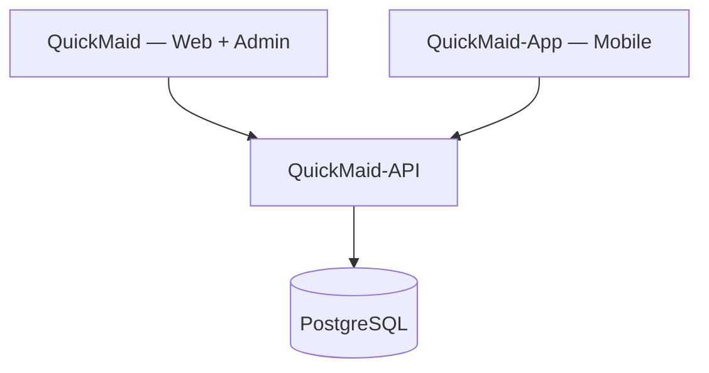

# QuickMaid Platform Overview

How all QuickMaid products fit together. **This file lives in the web repo** — mobile app documentation will be maintained separately in **QuickMaid-App**.

## Three repositories

| Repository | Purpose | Documentation |
|------------|---------|---------------|
| **QuickMaid** | Marketing site, web book/partner flows, admin console (Angular 18) | **This repo** → [`docs/`](./README.md) |
| **QuickMaid-App** | Customer + Partner native mobile apps (React Native + Expo) | **Separate repo** (to be created) |
| **QuickMaid-API** | Backend REST API + business logic | **Separate repo** (Phase 3) |

## One database

All three clients connect to **one PostgreSQL database** through **QuickMaid-API**. Apps never talk to the DB directly.

## What lives where

| Feature | Web (this repo) | Mobile (QuickMaid-App) | Admin (this repo) |
|---------|-----------------|------------------------|-------------------|
| Customer booking | `/book` web flow | Full native app | `/admin/bookings` |
| Partner jobs | `/partner` web portal | Full native app | `/admin/maids` |
| Ops / finance / compliance | — | — | 25 admin screens |
| Marketing landing | `/` | App store listing + deep links | — |

## Mobile apps (summary only)

| App | Screens (planned) | Repo |
|-----|-------------------|------|
| Customer | 42 | QuickMaid-App |
| Partner | 32 | QuickMaid-App |

**Framework (decided):** React Native + Expo, TypeScript monorepo.

Detailed screen lists, build phases, and mobile architecture → **QuickMaid-App repository docs** (not maintained here).

## Build order (platform-wide)

| Phase | Repository | Deliverable |
|-------|------------|-------------|
| 1 | QuickMaid | Web + admin demo ✅ (current) |
| 2 | QuickMaid-App | Customer app MVP |
| 3 | QuickMaid-App | Partner app |
| 4 | QuickMaid-API | API + database |
| 5 | All | Connect web + mobile to live API |

## Related docs (this repo only)

- [Public Guide](./PUBLIC_GUIDE.md) — landing, book, partner web pages
- [Admin Guide](./ADMIN_GUIDE.md) — admin console
- [Phase 3 Backend](./PHASE3_BACKEND.md) — API plan for all clients
