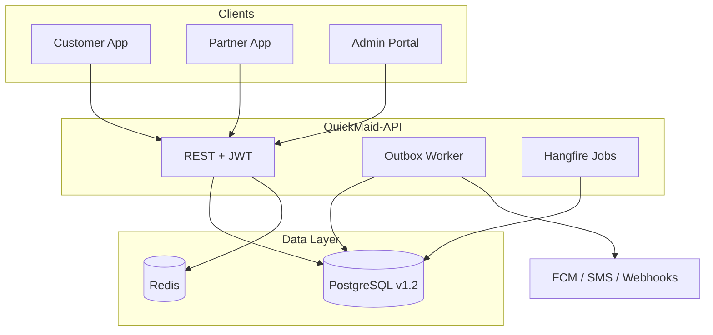

# QuickMaid Database — Final Optimized Schema (v1.2)

**Status:** Production-ready specification  
**Canonical source:** `quickmaid.schema.dbml`  
**Migration path:** v1.0 → `v1.1.migration.sql` → `v1.2.migration.sql`  
**Tables:** 72 | **Enums:** 38+ | **Clients:** Customer App, Partner App, Admin Portal  
**Date:** June 2026

---

## 1. Executive summary

v1.2 finalizes the QuickMaid PostgreSQL schema for enterprise SaaS deployment. It builds on v1.1 (mobile/admin gap closure) and adds operational infrastructure required for scale: transactional outbox, corporate B2B module, training compliance, feature flags, encrypted integrations, and pre-aggregated analytics.

| Version | Tables | Focus |
|---------|--------|-------|
| v1.0 | 60 | Full marketplace foundation |
| v1.1 | 63 | Mobile + admin field parity, idempotency, dispatch TTL |
| **v1.2** | **72** | **Outbox, B2B, training, ops, performance hardening** |

**Verdict:** Schema is now **enterprise-grade and implementation-ready**. Remaining work is API wiring (EF Core), Redis dispatch, and partition rollout in production.

---

## 2. Architecture overview



**Single-database modular monolith** — one PostgreSQL instance serves all three clients. Hot paths (dispatch offers, live GPS, OTP) use Redis; durable state and audit trails live in PostgreSQL.

---

## 3. Final optimized schema

### 3.1 Domain modules

| Module | Tables | Purpose |
|--------|--------|---------|
| **Geography** | `cities`, `zones`, `zone_services` | Multi-city expansion |
| **Catalogue** | `service_categories`, `services`, `skills`, `time_slots`, `subscription_plans` | Service catalogue & pricing |
| **Identity** | `users`, `user_roles`, `customers`, `maids`, `admin_users`, `otp_verifications`, `auth_sessions` | Auth substrate + profiles |
| **Customer** | `customer_addresses`, `customer_preferences`, `customer_payment_methods`, `customer_saved_services`, `customer_subscriptions`, `wallet_accounts`, `wallet_ledger_entries` | Profile, wallet, Plus |
| **Partner** | `maid_applications`, `maid_documents`, `maid_skills_map`, `maid_zones_map`, `maid_availability`, `maid_dispatch_preferences`, `maid_location_pings`, `maid_training_completions` | Onboarding, KYC, dispatch |
| **Bookings** | `bookings`, `booking_line_items`, `booking_assignments`, `booking_status_events`, `booking_reviews`, `booking_disputes` | Full lifecycle |
| **Payments** | `payment_orders`, `payment_transactions`, `refunds` | Razorpay integration |
| **Corporate B2B** | `corporate_accounts`, `corporate_account_users`, `corporate_booking_policies` | Enterprise accounts |
| **Payouts** | `payout_batches`, `maid_payout_lines`, `maid_earnings_ledger` | Partner settlements |
| **Support** | `support_tickets`, `support_messages`, `support_attachments`, `knowledge_base_articles` | CS + help center |
| **Notifications** | `notifications`, `device_push_tokens` | Multi-channel comms |
| **Platform** | `domain_events`, `api_idempotency_keys`, `feature_flags`, `integration_configs`, `analytics_daily_snapshots`, `schema_migrations` | Ops & reliability |
| **Admin** | `admin_roles`, `permissions`, `admin_role_permissions`, `audit_logs`, `platform_settings`, `dsar_requests`, `report_schedules`, `admin_alert_rules` | RBAC, compliance |
| **Training** | `training_courses`, `maid_training_completions` | Partner quality program |
| **Marketing** | `referrals`, `coupon_campaigns`, `customer_coupons`, `coupon_redemptions`, `waitlist_entries` | Growth |
| **Status mapping** | `status_display_mappings` | Client ↔ DB label bridge |

### 3.2 Core entity relationships

```
users (1) ──► (0..1) customers | maids | admin_users
customers (1) ──► (*) customer_addresses, bookings, wallet_ledger
maids (1) ──► (*) booking_assignments, maid_earnings_ledger, maid_training_completions
bookings (1) ──► (*) booking_line_items, booking_assignments, booking_status_events
bookings (*) ──► (0..1) corporate_accounts [B2B]
corporate_accounts (1) ──► (*) corporate_account_users ──► customers
payment_transactions (1) ──► (0..*) refunds
domain_events (*) ──► aggregate (booking|payment|maid|…) [outbox pattern]
```

### 3.3 Key tables (v1.2 additions highlighted)

#### `domain_events` *(new)*
| Column | Type | Notes |
|--------|------|-------|
| id | uuid PK | |
| aggregate_type | varchar(50) | `booking`, `payment`, `maid`, `assignment` |
| aggregate_id | uuid | Entity ID |
| event_type | varchar(100) | `booking.created`, `job.offered`, `payment.captured` |
| payload | jsonb | Event body for consumers |
| status | domain_event_status | `pending` → `published` / `failed` |
| published_at | timestamp | Set when dispatched |
| retry_count | int | Worker retry tracking |

**Indexes:** `(status, created_at) WHERE pending`, `(aggregate_type, aggregate_id)`, `event_type`

#### `corporate_account_users` *(new)*
| Column | Type | Notes |
|--------|------|-------|
| corporate_account_id + customer_id | composite PK | |
| role | corporate_user_role | `admin`, `approver`, `employee` |
| department | varchar(100) | Optional |
| is_active | boolean | |

#### `corporate_booking_policies` *(new)*
| Column | Type | Notes |
|--------|------|-------|
| corporate_account_id | uuid PK | 1:1 with account |
| approval_required | boolean | Manager approval flow |
| spend_limit_paise | bigint | Per-booking cap |
| auto_approve_under_paise | int | Fast-path threshold |
| allowed_zones | uuid[] | Geo restriction |

#### `bookings` *(extended)*
| New column | Type | Purpose |
|------------|------|---------|
| corporate_account_id | uuid FK | B2B booking link |
| row_version | int | Optimistic locking on status transitions |

#### `training_courses` / `maid_training_completions` *(new)*
Mandatory partner onboarding courses with quiz scores and recertification expiry.

#### `feature_flags` / `integration_configs` *(new)*
Runtime toggles and AES-encrypted third-party credentials (Razorpay, FCM, MSG91, etc.).

#### `analytics_daily_snapshots` *(new)*
Pre-computed daily KPIs per city — powers admin dashboard without live aggregation.

#### `schema_migrations` *(new)*
Tracks applied migration versions with checksums.

---

## 4. What changed (v1.1 → v1.2)

### 4.1 Fixes applied

| Issue (from architect review) | Fix |
|-------------------------------|-----|
| No transactional outbox for FCM/SMS | `domain_events` table + worker pattern |
| Corporate module incomplete | `corporate_account_users`, `corporate_booking_policies`, `bookings.corporate_account_id` |
| Training module deferred | `training_courses`, `maid_training_completions` + seed data |
| No feature flag storage | `feature_flags` (key + environment PK) |
| Integration keys in env only | `integration_configs` with encrypted blob |
| Admin dashboard live aggregation | `analytics_daily_snapshots` nightly job |
| Wallet source `adjustment` mismatch | Added `adjustment` to `wallet_entry_source` enum |
| Denormalized counters undocumented | `counters_synced_at`, `rating_synced_at` + column comments |
| Missing rating CHECK | `chk_review_rating` (1–5) in migration |
| Missing corporate indexes | `status`, `city_id` on `corporate_accounts` |
| Booking review query paths | Indexes on `customer_id`, `created_at` |
| Location ping booking lookup | Composite index `(booking_id, recorded_at)` |

### 4.2 Improvements made

- **Optimistic concurrency** on `bookings.row_version` — prevents lost updates during dispatch race conditions
- **Partitioning strategy** documented for `maid_location_pings`, `audit_logs`, `notifications`
- **B2B booking path** — corporate users book under company account with policy enforcement
- **Migration tracking** — `schema_migrations` for audit trail
- **Training compliance** — mandatory courses gate partner activation
- **Separation of concerns** — `feature_flags` vs `platform_settings` (runtime vs config)

### 4.3 Removed / deprecated issues

| Item | Action |
|------|--------|
| `maids.age` | **Deprecated** — use `date_of_birth`; column retained for backward compatibility |
| Duplicate status columns per client | **Avoided** — `status_display_mappings` + API layer (v1.1) |
| Wallet `adjustment` vs `admin_adjustment` | **Resolved** — both enum values; API normalizes |
| Training "deferred to v1.2" | **Implemented** |
| Outbox "deferred to v1.2" | **Implemented** |

### 4.4 Breaking changes

**None in v1.2** — all changes are additive. v1.1 breaking items (if upgrading from v1.0):

| Change | Impact | Migration |
|--------|--------|-----------|
| `customers.public_id` NOT NULL | API must return `public_id` | v1.1 backfill script |
| `notifications.app_client` NOT NULL | Queries must filter by app | v1.1 backfill `'customer'` |

---

## 5. Status display mappings (client ↔ DB)

### Customer app

| App label | DB `booking_status` |
|-----------|---------------------|
| `upcoming` | `confirmed`, `assigned`, `in_progress` |
| `completed` | `completed` |
| `cancelled` | `cancelled`, `no_show` |

### Partner app

| App label | Source |
|-----------|--------|
| `pending` | `booking_assignments.response = pending` |
| `accepted` | `response = accepted` |
| `declined` | `response = declined` |

### Admin portal

| Admin label | DB value |
|-------------|----------|
| `progress` (tickets) | `in_review` |
| `ongoing` (bookings) | `assigned`, `in_progress` |

Seed data in `status_display_mappings` (v1.1 migration).

---

## 6. Migration guide

### 6.1 Prerequisites

- PostgreSQL 14+
- Greenfield: `quickmaid.schema.v1.2.final.sql` (recommended)
- Legacy: v1.0 base schema applied (`quickmaid.schema.postgresql.sql`)
- Extensions: `pgcrypto` (for `gen_random_uuid()`)

### 6.2 Step-by-step

```bash
# Greenfield (recommended) — single file, v1.2 FINAL
psql -U quickmaid -d quickmaid -f quickmaid.schema.v1.2.final.sql

# OR incremental upgrade from v1.0:
# psql -f quickmaid.schema.postgresql.sql
# psql -f quickmaid.schema.v1.1.migration.sql
# psql -f quickmaid.schema.v1.2.migration.sql

# Step 4 — Verify
psql -U quickmaid -d quickmaid -c "SELECT * FROM schema_migrations ORDER BY applied_at;"
```

### 6.3 Post-migration (maintenance window)

Run **outside** the migration transaction:

#### A. Table partitioning (high volume)

```sql
-- Example: maid_location_pings monthly partition
-- 1. Create partitioned parent (new deployments)
CREATE TABLE maid_location_pings_partitioned (
  LIKE maid_location_pings INCLUDING ALL
) PARTITION BY RANGE (recorded_at);

-- 2. Create monthly child tables
CREATE TABLE maid_location_pings_2026_06
  PARTITION OF maid_location_pings_partitioned
  FOR VALUES FROM ('2026-06-01') TO ('2026-07-01');

-- 3. Migrate data, swap names (see PostgreSQL docs for zero-downtime swap)
```

Repeat for `audit_logs` (partition on `created_at`) and `notifications` (partition on `created_at`).

#### B. Materialized view (optional)

```sql
CREATE MATERIALIZED VIEW mv_daily_ops_summary AS
SELECT
  snapshot_date,
  city_id,
  bookings_created,
  bookings_completed,
  gmv_paise,
  accept_rate_pct,
  cancel_rate_pct
FROM analytics_daily_snapshots
ORDER BY snapshot_date DESC;

CREATE UNIQUE INDEX ON mv_daily_ops_summary (snapshot_date, city_id);

-- Refresh nightly via Hangfire
REFRESH MATERIALIZED VIEW CONCURRENTLY mv_daily_ops_summary;
```

#### C. Background jobs (Hangfire)

| Job | Frequency | Purpose |
|-----|-----------|---------|
| `OutboxPublisher` | Every 5s | Publish `domain_events` where `status = pending` |
| `CounterSyncJob` | Hourly | Refresh `customers.total_visits`, `maids.avg_rating`, etc. |
| `AnalyticsSnapshotJob` | Daily 00:30 IST | Populate `analytics_daily_snapshots` |
| `IdempotencyCleanup` | Daily | Purge `api_idempotency_keys` older than 24h |
| `NotificationTTL` | Weekly | Archive/delete read notifications > 90 days |
| `LocationPingArchive` | Monthly | Move old partitions to cold storage |

#### D. Counter sync SQL (reference)

```sql
-- Example: sync maid avg_rating from reviews
UPDATE maids m SET
  avg_rating = sub.avg_rating,
  rating_synced_at = now()
FROM (
  SELECT maid_id, ROUND(AVG(rating)::numeric, 2) AS avg_rating
  FROM booking_reviews
  GROUP BY maid_id
) sub
WHERE m.id = sub.maid_id;
```

### 6.4 Rollback strategy

v1.2 is additive — rollback = drop new tables only (no data loss on core tables):

```sql
BEGIN;
DROP TABLE IF EXISTS schema_migrations CASCADE;
DROP TABLE IF EXISTS analytics_daily_snapshots CASCADE;
DROP TABLE IF EXISTS integration_configs CASCADE;
DROP TABLE IF EXISTS feature_flags CASCADE;
DROP TABLE IF EXISTS maid_training_completions CASCADE;
DROP TABLE IF EXISTS training_courses CASCADE;
DROP TABLE IF EXISTS domain_events CASCADE;
DROP TABLE IF EXISTS corporate_booking_policies CASCADE;
DROP TABLE IF EXISTS corporate_account_users CASCADE;
ALTER TABLE bookings DROP COLUMN IF EXISTS corporate_account_id;
ALTER TABLE bookings DROP COLUMN IF EXISTS row_version;
-- Drop new enum types if unused
COMMIT;
```

---

## 7. Scalability & architecture notes

### 7.1 Why this design scales

| Pattern | Benefit |
|---------|---------|
| **Single DB, modular domains** | Simple ops; clear FK boundaries; easy EF Core DbContext split |
| **Append-only ledgers** | `wallet_ledger`, `booking_status_events`, `maid_earnings_ledger` — audit-safe, no update races |
| **Snapshot columns** | `address_snapshot`, `service_name` on line items — historical accuracy without joins |
| **Transactional outbox** | Reliable async delivery without dual-write bugs |
| **Denormalized counters + sync jobs** | Fast profile reads; ledger/reviews remain source of truth |
| **Partial unique indexes** | One active assignment per booking — DB-enforced dispatch invariant |
| **Idempotency keys** | Safe POST retries for payments and bookings at scale |
| **Partitioning ready** | Location pings, audit logs, notifications — bounded query scans |
| **Pre-aggregated analytics** | Admin dashboard O(1) reads vs O(n) booking scans |
| **Feature flags** | Ship features without schema migrations |
| **Encrypted integrations** | Rotate API keys without redeploy |

### 7.2 Future extensibility (no major redesign needed)

| Future feature | Extension point |
|----------------|-----------------|
| Multi-city launch | Seed `cities` + `zones`; existing FK chain works |
| Subscription bundles | `plus_plans` + `customer_subscriptions` already present |
| Corporate invoicing | `corporate_accounts` + `bookings.corporate_account_id` + policies |
| Partner tiers / badges | Add `maid_badges` table; FK to `maids` |
| Dynamic pricing | `services` + `zone_services` pricing columns |
| Chat support | Extend `support_messages` or add `chat_threads` |
| ML dispatch scoring | Read `maid_location_pings` + `booking_reviews`; no schema change |
| White-label cities | `platform_settings` + `feature_flags` per environment |
| GDPR data export | `dsar_requests` workflow + profile soft-delete |
| Event sourcing (full) | `domain_events` already captures aggregate events |

### 7.3 Performance guidelines

- **Hot queries:** `(zone_id, status, visit_date)` on bookings, `(maid_id, expires_at) WHERE pending` on assignments
- **Connection pooling:** PgBouncer in transaction mode; API uses EF Core with retry policy
- **Read replicas:** Route analytics and report queries to replica; writes to primary
- **Redis:** Dispatch offer state, OTP, session cache — never duplicate financial state
- **JSONB:** Use for snapshots only; index with GIN sparingly

### 7.4 Industry alignment

This schema follows patterns used by marketplace SaaS platforms:

- **Stripe-style** immutable payment/refund records
- **Uber-style** assignment + location ping archive
- **Salesforce-style** corporate account hierarchy
- **Transactional outbox** (Chris Richardson / microservices.io)
- **Optimistic locking** on aggregate roots (DDD)
- **RBAC** with permission junction table (enterprise admin)

---

## 8. Implementation checklist (API phase)

- [ ] EF Core entities for all 72 tables
- [ ] `IOutboxPublisher` reading `domain_events`
- [ ] Status mapping middleware using `status_display_mappings`
- [ ] `row_version` check on `PATCH /bookings/{id}/status`
- [ ] Corporate booking flow with policy validation
- [ ] Training gate: block `maids.status = active` until mandatory courses complete
- [ ] `feature_flags` cached in Redis (60s TTL)
- [ ] `integration_configs` decrypted at startup via KMS
- [ ] Hangfire jobs registered per §6.3
- [ ] Partition rollout scheduled before 10K daily bookings

---

## 9. File index

| File | Purpose |
|------|---------|
| `quickmaid.schema.dbml` | **Canonical v1.2** — import to dbdiagram.io |
| `quickmaid.schema.v1.2.final.sql` | **v1.2 full DDL + seeds (greenfield deploy)** |
| `quickmaid.schema.postgresql.sql` | v1.0 full DDL (legacy base) |
| `quickmaid.schema.v1.1.migration.sql` | v1.0 → v1.1 ALTER script |
| `quickmaid.schema.v1.2.migration.sql` | v1.1 → v1.2 ALTER script |
| `SCHEMA_REVISION_v1.1.md` | v1.1 changelog |
| `SCHEMA_FINAL.md` | **This document** — v1.2 final spec |
| `IMPORT.md` | dbdiagram.io import instructions |

---

## 10. Sign-off

| Criterion | Status |
|-----------|--------|
| Customer app flows supported | ✅ |
| Partner app flows supported | ✅ |
| Admin portal flows supported | ✅ |
| Booking lifecycle complete | ✅ |
| Payments & wallet immutable | ✅ |
| Notifications & history | ✅ |
| B2B corporate ready | ✅ |
| Training compliance | ✅ |
| Async reliability (outbox) | ✅ |
| Scale path (partitioning, snapshots) | ✅ |
| Backward compatible (additive) | ✅ |

**Schema v1.2 is approved for QuickMaid-API implementation.**
