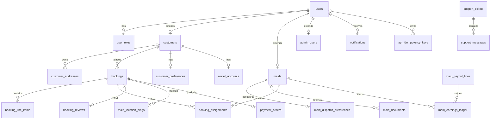

# QuickMaid Database — Schema Revision v1.1

**Base:** `quickmaid.schema.dbml` v1.0 (60 tables)  
**Revised:** v1.1 (63 tables, 4 new enums, 28 column additions)  
**Audience:** Backend (.NET), Mobile, Admin CRM  
**Date:** June 2026

---

## 1. Executive summary

The v1.0 schema is **production-grade and comprehensive** — it already covers 60 tables across catalogue, auth, bookings, payments, KYC, payouts, support, and admin RBAC. No tables were removed.

**v1.1 closes gaps** discovered by cross-reviewing:

| Source | Path |
|--------|------|
| Customer mobile contract | `QuickMaid-App/apps/customer/docs/CUSTOMER_DATA.md` |
| Partner mobile contract | `QuickMaid-App/apps/partner/docs/PARTNER_DATA.md` |
| Admin CRM view-models | `QuickMaid/src/app/admin/**` |
| API contract | `QuickMaid-App/docs/API-CONTRACT.md` |
| Cross-app bridge events | `QuickMaid-App/docs/FSD/CROSS-APP-BRIDGE.md` |

**Result:** Three new tables, targeted column additions, enum extensions, and performance indexes — **fully backward-compatible** with v1.0 (additive migration only).

---

## 2. Current architecture (unchanged)

```
Customer App ──┐
Partner App  ──┼──► QuickMaid-API ──► PostgreSQL (single DB)
Admin Portal ──┘         │
                         └──► Redis (dispatch hot state, OTP, idempotency)
```

**Design principles retained from v1.0:**

- Single database for all clients
- `users` + role-specific profiles (`customers`, `maids`, `admin_users`)
- Financial immutability (ledger append-only)
- Booking snapshots (JSONB `address_snapshot`)
- RBAC server-side for admin
- Dispatch hot state in Redis; assignments persisted in DB

---

## 3. Gap analysis (v1.0 vs applications)

### 3.1 Customer app gaps

| Gap | v1.0 | v1.1 fix |
|-----|------|----------|
| No `customers.public_id` (`CU-XXXXXXX`) | Missing | Add `public_id` column |
| Email on profile | Only `users.email` | Add `customers.email` (denormalized for API) |
| Mobile status `upcoming` | DB has `confirmed`, `assigned` | API mapping table (documented §5) |
| Payment mode `emi` | Not in enum | Add to `payment_method_type` |
| Wallet source `adjustment` | Only `admin_adjustment` | Document API alias; no DB change |

### 3.2 Partner app gaps

| Gap | v1.0 | v1.1 fix |
|-----|------|----------|
| `firstName`, `lastName`, `dateOfBirth` | Only `display_name`, `age` | Add columns on `maids` |
| `maritalStatus`, `travelMode`, `workRadiusKm` | Missing | New enums + columns |
| `alternatePhone`, `photoUri` | Missing | Add `alternate_phone`, `photo_url` |
| `referredByCode` | Missing | Add `referred_by_code` |
| KYC `selfie` doc type | Only `profile_photo` | Add `selfie` to `kyc_doc_type` |
| Dispatch `autoAssignOffers` | Not in DB | New `maid_dispatch_preferences` table |
| Job offer TTL | No `expires_at` on assignment | Add to `booking_assignments` |
| Job status `declined` | `assignment.response = declined` | Document mapping (§5) |

### 3.3 Admin portal gaps

| Gap | v1.0 | v1.1 fix |
|-----|------|----------|
| Ticket status `progress` | DB has `in_review` | API maps `progress` ↔ `in_review` |
| Corporate `seats`, `mrr`, `erpId` | Missing | Add columns on `corporate_accounts` |
| Customer health `churned` | In DB, not in admin UI | No DB change; align admin UI |
| Training module | No tables | Deferred to v1.2 (`training_courses`) |

### 3.4 Backend / API gaps

| Gap | v1.0 | v1.1 fix |
|-----|------|----------|
| `Idempotency-Key` header | Not stored | New `api_idempotency_keys` table |
| Notifications per app | No `app_client` on `notifications` | Add column |
| Partial unique: one active assignment | App-layer only | Add partial unique index (SQL) |

---

## 4. Revised schema — changes detail

### 4.1 New enums

```sql
CREATE TYPE marital_status AS ENUM ('single', 'married', 'widowed', 'other');
CREATE TYPE travel_mode AS ENUM ('walk', 'cycle', 'bus', 'auto', 'bike');
-- payment_method_type: ADD VALUE 'emi';
-- kyc_doc_type: ADD VALUE 'selfie';
```

| Enum | Why |
|------|-----|
| `marital_status` | Partner apply form + admin maid profile |
| `travel_mode` | Dispatch distance/ETA calculation |
| `emi` | Customer checkout `PaymentMode` includes EMI |
| `selfie` | Partner KYC wizard uses `selfie` label (alias of `profile_photo` in API) |

### 4.2 Modified tables

#### `customers` (+2 columns)

| Column | Type | Why |
|--------|------|-----|
| `public_id` | `varchar(20) UNIQUE NOT NULL` | Mobile `CU-{7-digit}` display ID |
| `email` | `varchar(255)` | Profile screen; avoids join to `users` on every read |

#### `maids` (+9 columns)

| Column | Type | Why |
|--------|------|-----|
| `first_name` | `varchar(80)` | KYC name match, apply form |
| `last_name` | `varchar(80)` | KYC name match |
| `date_of_birth` | `date` | Age verification; replaces inferred `age` |
| `marital_status` | `marital_status` | Apply form field |
| `travel_mode` | `travel_mode` | Dispatch ETA |
| `work_radius_km` | `smallint DEFAULT 5` | Auto-assign radius filter |
| `alternate_phone` | `varchar(15)` | Profile backup contact |
| `photo_url` | `text` | Profile photo (S3 URL) |
| `referred_by_code` | `varchar(20)` | Partner referral onboarding |

#### `booking_assignments` (+2 columns)

| Column | Type | Why |
|--------|------|-----|
| `expires_at` | `timestamp` | Offer TTL (90s auto-assign); partner countdown |
| `offer_round` | `smallint DEFAULT 1` | Reassignment attempt number |

#### `notifications` (+1 column)

| Column | Type | Why |
|--------|------|-----|
| `app_client` | `varchar(20) NOT NULL` | Separate inbox per app (`customer` / `maid`) |

#### `corporate_accounts` (+4 columns)

| Column | Type | Why |
|--------|------|-----|
| `seats` | `int` | Admin corporate CRM |
| `mrr_paise` | `bigint` | Monthly recurring revenue |
| `erp_external_id` | `varchar(50)` | Admin `erpId` field |
| `trial_ends_at` | `date` | Trial / negotiating status |

### 4.3 New tables

#### `maid_dispatch_preferences` (1:1 with `maids`)

| Column | Type | Why |
|--------|------|-----|
| `maid_id` | `uuid PK FK` | Partner settings |
| `auto_assign_enabled` | `boolean DEFAULT true` | `PartnerSettingsPreferences` toggle |
| `alert_new_jobs` | `boolean DEFAULT true` | Notification pref |
| `alert_sound_enabled` | `boolean DEFAULT true` | Partner alert sound |
| `max_concurrent_jobs` | `smallint DEFAULT 1` | Capacity guard |
| `updated_at` | `timestamp` | |

#### `api_idempotency_keys`

| Column | Type | Why |
|--------|------|-----|
| `key` | `varchar(64) PK` | `Idempotency-Key` header |
| `user_id` | `uuid FK` | Owner |
| `endpoint` | `varchar(120)` | e.g. `POST /bookings` |
| `response_status` | `smallint` | Cached HTTP status |
| `response_body` | `jsonb` | Cached response |
| `created_at` | `timestamp` | |
| `expires_at` | `timestamp` | TTL 24h |

#### `status_display_mappings` (reference data)

| Column | Type | Why |
|--------|------|-----|
| `domain` | `varchar(32)` | `booking_customer`, `booking_partner`, `ticket_admin` |
| `canonical_status` | `varchar(32)` | DB enum value |
| `display_status` | `varchar(32)` | App-specific label |
| `sort_order` | `smallint` | Filter rail ordering |

Seeded rows map DB ↔ mobile ↔ admin vocabulary (§5).

### 4.4 New indexes & constraints

| Object | Definition | Why |
|--------|------------|-----|
| `idx_bookings_customer_active` | `(customer_id, visit_date DESC) WHERE status NOT IN ('cancelled','completed')` | Customer bookings tab |
| `idx_assignments_pending` | `(maid_id, expires_at) WHERE response = 'pending' AND is_active` | Partner requests inbox |
| `idx_location_latest` | `(booking_id, recorded_at DESC)` | Customer track screen |
| `idx_notifications_unread` | `(user_id, app_client, created_at DESC) WHERE NOT is_read` | Inbox badge count |
| `uq_assignment_active` | `UNIQUE (booking_id) WHERE is_active AND response IN ('pending','accepted')` | One active assignee per booking |
| `uq_customers_public_id` | `UNIQUE (public_id)` | Mobile ID lookup |
| `chk_booking_review_rating` | `rating BETWEEN 1 AND 5` | Data integrity |

---

## 5. Status mapping (API layer)

Mobile apps use simplified status labels. **Do not add duplicate status columns on `bookings`** — map in API using `booking_status` + `booking_assignments.response`.

### Customer app `booking.status`

| Mobile value | DB `bookings.status` | Condition |
|--------------|----------------------|-----------|
| `upcoming` | `confirmed` | No maid assigned yet |
| `upcoming` | `assigned` | Maid assigned, visit not started |
| `upcoming` | `en_route` | Maid en route (optional Phase 2) |
| `upcoming` | `in_progress` | Visit started |
| `completed` | `completed` | — |
| `cancelled` | `cancelled` | — |
| `cancelled` | `no_show` | Map to cancelled + reason |

### Partner app `JobStatus`

| Mobile value | Source | Condition |
|--------------|--------|-----------|
| `pending` | `booking_assignments` | `response = pending` |
| `accepted` | `bookings.status` | `assigned` + assignment `accepted` |
| `in_progress` | `bookings.status` | `in_progress` |
| `completed` | `bookings.status` | `completed` |
| `declined` | `booking_assignments` | `response = declined` |

### Admin CRM booking status

| Admin UI | DB mapping |
|----------|------------|
| `ongoing` | `assigned`, `en_route`, `in_progress` |
| `completed` | `completed` |
| `no-show` | `no_show` |

### Support ticket status

| Admin UI | DB `ticket_status` |
|----------|------------------|
| `progress` | `in_review` |
| `open` | `open` |
| `resolved` | `resolved` |
| `snoozed` | `snoozed` |

---

## 6. Entity relationship (v1.1)



---

## 7. Impact analysis

### 7.1 Customer app

| Area | Impact | Action |
|------|--------|--------|
| Profile API | `public_id`, `email` in `GET /customers/me` | Map new fields in `*.api.ts` |
| Bookings list | Status mapping layer | Add `mapBookingStatusForCustomer()` in API client |
| Checkout EMI | `payment_method_type.emi` supported | No app change if already in UI |
| Wallet | `admin_adjustment` → display as `adjustment` | Map in DTO |
| Notifications | Filter by `app_client=customer` | Update hook when API wired |
| **Breaking changes** | None | Additive only |

### 7.2 Partner app

| Area | Impact | Action |
|------|--------|--------|
| Profile | New maid fields returned | Extend `PartnerProfile` type |
| Requests | `expires_at` on pending jobs | Show countdown in `PartnerRequestsScreen` |
| Settings | `maid_dispatch_preferences` | Replace AsyncStorage prefs on API cutover |
| KYC | `selfie` doc type | Map `selfie` ↔ `profile_photo` in upload API |
| Job status | Map from assignment + booking | Update `usePartnerJobs` mapper |
| **Breaking changes** | None | Additive only |

### 7.3 Admin portal

| Area | Impact | Action |
|------|--------|--------|
| Customers | `public_id` column in grid | Add column to `customers.component.ts` |
| Maids | Extended profile fields | Update `MaidProfileDetail` interface |
| Corporate | `seats`, `mrr_paise` | Update `corporate.component.ts` when API exists |
| Tickets | Map `in_review` → `progress` in UI | One-line mapper |
| Dispatch | `expires_at`, `offer_round` | New columns in dispatch board |
| **Breaking changes** | None | Demo localStorage unaffected until API |

### 7.4 Backend (ASP.NET / new)

| Area | Impact | Action |
|------|--------|--------|
| EF Core entities | 3 new tables, column additions | Run v1.1 migration |
| Dispatch service | Use `expires_at`, `offer_round` | Hangfire job `ExpireStaleOffers` |
| API middleware | `api_idempotency_keys` | Idempotency middleware |
| DTOs | Status mappers per `app_client` | Shared mapping service |
| Seed data | `status_display_mappings` rows | Include in `DbSeeder` |

---

## 8. Migration plan

### Phase A — Schema (zero downtime prep)

1. Apply `quickmaid.schema.v1.1.migration.sql` on dev/staging
2. Backfill `customers.public_id` from sequence `CU-{id}`
3. Backfill `maids.first_name/last_name` from `display_name` split
4. Seed `status_display_mappings`
5. Regenerate `quickmaid.schema.postgresql.sql` from DBML

### Phase B — API (ASP.NET)

1. EF entities for new tables
2. Status mapping service
3. Idempotency middleware
4. Dispatch TTL worker

### Phase C — Clients

1. Mobile `EXPO_PUBLIC_USE_API=true`
2. Admin replace localStorage with HTTP

### Rollback

All v1.1 changes are additive. Rollback = drop new tables/columns (see migration file §ROLLBACK).

---

## 9. Files in this revision

| File | Purpose |
|------|---------|
| `quickmaid.schema.dbml` | Updated canonical design (v1.1) |
| `quickmaid.schema.v1.1.migration.sql` | PostgreSQL ALTER script |
| `SCHEMA_REVISION_v1.1.md` | This document |
| `quickmaid.schema.postgresql.sql` | Regenerate after review |

---

## 10. Deferred to v1.2 (not in scope)

| Item | Reason |
|------|--------|
| `training_courses` / certifications | Admin quality module has no schema yet |
| `integration_secrets` table | Admin integrations demo-only |
| Table partitioning (`audit_logs`, `maid_location_pings`) | Ops concern at scale |
| Read replicas | Infrastructure, not schema |
| GraphQL / event store | REST sufficient for Phase 4 |

---

## 11. Review checklist

- [x] Customer `CUSTOMER_DATA.md` fields covered
- [x] Partner `PARTNER_DATA.md` fields covered
- [x] Admin CRM view-models aligned
- [x] Mobile API contract (`API-CONTRACT.md`) compatible
- [x] Cross-app bridge events map to `booking_status_events`
- [x] Financial tables unchanged (immutable ledger preserved)
- [x] RBAC tables unchanged
- [x] Additive migration only (no breaking DDL)

---

*Maintainers: bump version in DBML header when applying v1.2. Link from `QuickMaid-App/docs/API-CONTRACT.md`.*
